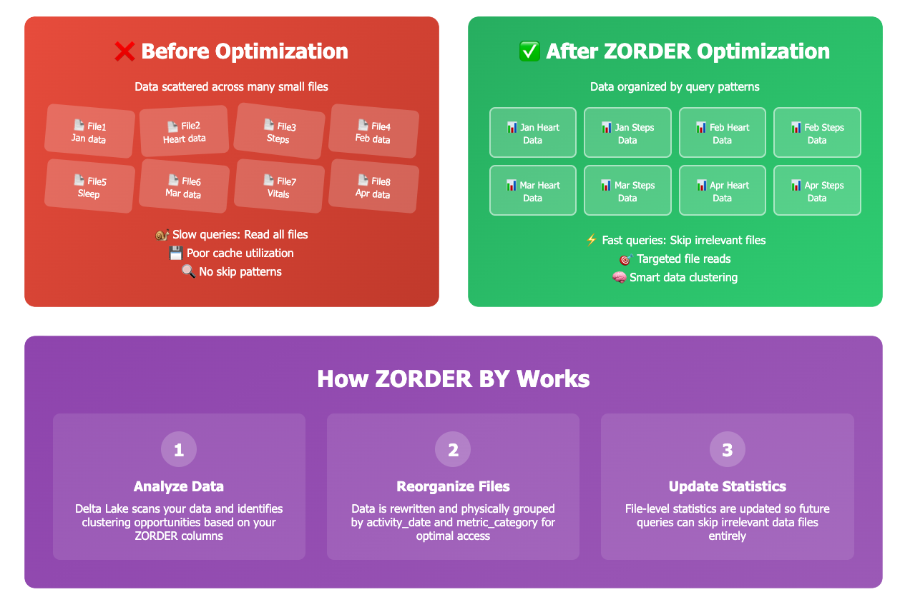

### 📊 Processing data using Medallion architevture

**Skills:** Medallion Architecture • Unity Catalog • Delta Lake • Apache Spark • SQL Optimization • Data Quality

---
### **Bronze Layer: Raw Data Ingestion**
- Unity Catalog volume creation and management
- Modern XML processing with Spark
- Delta table creation with proper governance metadata
- Understanding immutable data storage principles

### **Silver Layer: Data Transformation & Quality**
- Timestamp parsing and data type conversion
- Business logic implementation and categorization
- Data quality validation and monitoring
- Schema evolution and handling data changes

### **Gold Layer: Analytics & Business Intelligence**
- Daily aggregations and summary statistics
- Evidence-based scoring algorithms (applies to any domain)
- Pattern analysis and trend identification
- Creating dashboard-ready datasets

### **Production Optimization**
- Delta Lake ZORDER BY for 10x query performance
- Auto-optimization and maintenance strategies
- Monitoring and alerting best practices
- Scaling considerations for enterprise workloads

  

