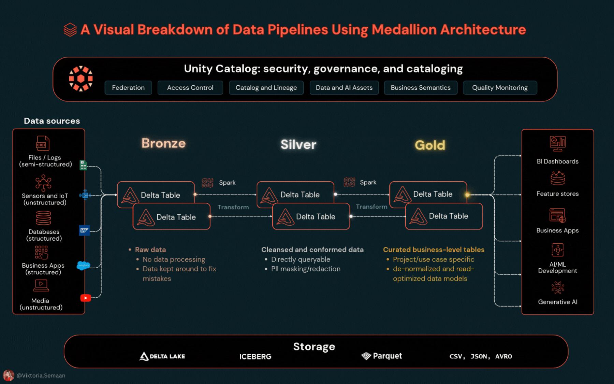

### 📊 Processing data using Medallion architevture

**Skills:** Medallion Architecture • Unity Catalog • Delta Lake • Apache Spark • SQL Optimization • Data Quality

---
### **Bronze Layer: Raw Data Ingestion**
- Unity Catalog volume creation and management
- Modern XML processing with Spark
- Delta table creation with proper governance metadata
- Understanding immutable data storage principles

### **Silver Layer: Data Transformation & Quality**
- Timestamp parsing and data type conversion
- Business logic implementation and categorization
- Data quality validation and monitoring
- Schema evolution and handling data changes

### **Gold Layer: Analytics & Business Intelligence**
- Daily aggregations and summary statistics
- Evidence-based scoring algorithms (applies to any domain)
- Pattern analysis and trend identification
- Creating dashboard-ready datasets

### **Production Optimization**
- Delta Lake ZORDER BY for 10x query performance
- Auto-optimization and maintenance strategies
- Monitoring and alerting best practices
- Scaling considerations for enterprise workloads

## 🛠️ Steps to begin

1. **Setup Databricks**
   - [Sign up for free account](https://bit.ly/dbx-free-signup)
   - Create new workspace

2. **Download the Required Files**

From this repository, download both:
   - `sample_export.xml` *(sample Apple Health file in the data folder)*
   - `Health Analytics Demo.ipynb` *(the Databricks notebook)*

3. **Upload to Databricks**
   - Go to the left sidebar → *Workspace* → *your user folder*
   - Click the *folder icon* and choose *"Import"*
   - Upload both the `.ipynb` and `.xml` files

4. **Execute notebook**  
   - Follow step-by-step instructions in the notebook

**Optional:** Export your own iPhone data:
  1. Open Health app on iPhone
  2. Tap profile picture (top right)
  3. Select "Export All Health Data"
  4. Extract zip file to get `export.xml`

